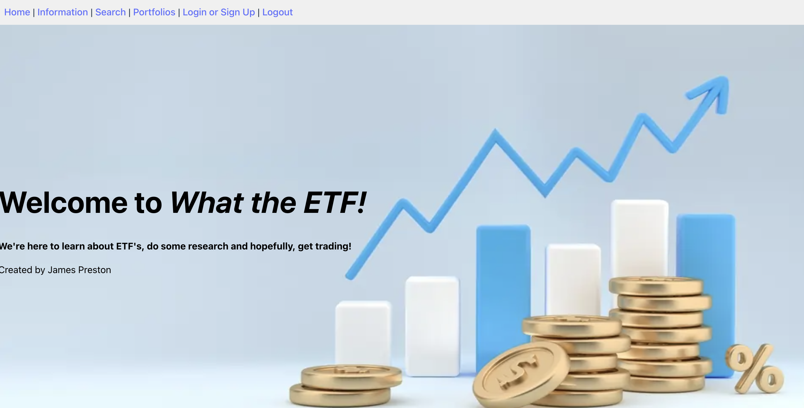
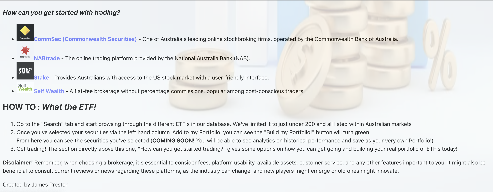
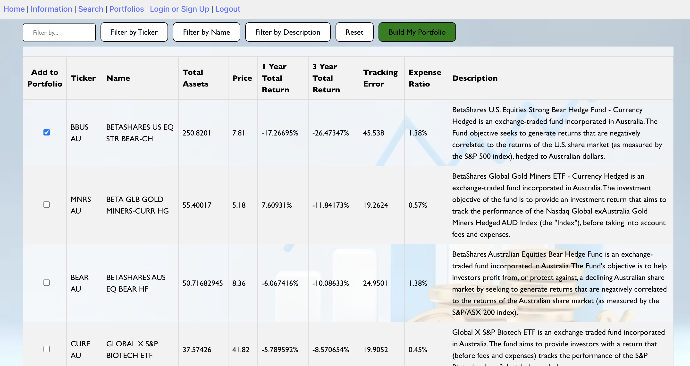
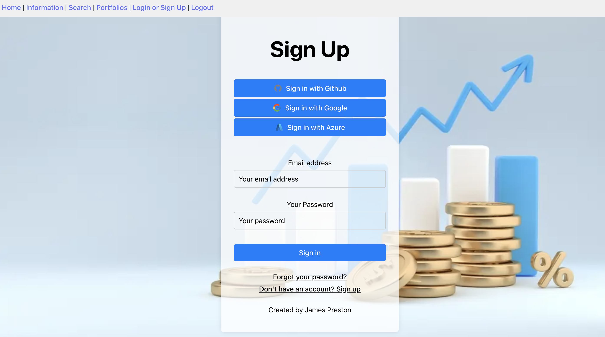

Project Title: What the ETF!  - https://wondrous-scone-9f5adc.netlify.app/

Description: 

* Somewhere between research, education and market information, What the ETF is a platform for entry level investors to 
  (1) Learn what is an ETF (2) The benefits (and shortcomings) of ETF's and why they are relevant in today's market environment (3) Look at real world ETF's and start putting together what their portfolio could look like!

* The application allows you to sign in with multiple third party providers (Google, Azure, Github) or with email. It stores your emaiil information in  Supabase for authoriisation, but then uses this information so that your experience is customised when you log back in (i.e. your securities you were looking at are saved!). 

* Integrated is a 'beginner level' database of Australian listed ETF's (just under ~200). This information has been pulled from Bloomberg as hardcoded values (as of date 10th August 2023) - it was stored as a CSV, then converted into JSON format to make it integratable with the applicatioin. 

* Using a Vite React front end framework, coupled with a Supabase database and authorisation management system, there is  flexibiliity and scalability to the program to continually add additional features (saving your ETF's as a specific basket to have multiple portfolios, ontop of this we can then look into Portfolio analytics (average return, industry weighting portfolio attribution and so oon), and expanding the universe of ETF's - even introducing an ETF data API!)

* The technologies that were used due to a few factors. Ease of availability, prior experience using React, and the interest to learn something new in database management (Supabase) and web service hosting (Netlify). The choice to NOT use an API for the ETF data and instead use static, historical data was due to time constraints of the project to deliver an MVP by the due date. 

Challanges: 

* As the appliciation was designed to remain quite simple for the scope of the assessment, there were no significant challenges with its production. Challenges did arise from the web service hosting as Supabase and Netlify were new technologies being used, however through use of their documentation and support from the GA team this was ~ relatively speaking ~ easily overcome. 

Roadmap: 

* As discussion prior, due to time constraints the application was designed to be relatively simple. The integration of new features is absolultely in the near future and would potentially include: 
1. Integration of an API service to pull EOD data from further historically, as well as expand the universe of securities. Currently it focuses on Australian ETFs (around 200) where in reality the universe is much, much bigger! 
2. Integration of a multi-portfolio system. When you select the securities to be integrated into a portfolio via the "Build My Portfolio", being able to save this as e.g. Portfolio 1, Industrials Portfolioi or Technology Portfolio etc would be an exciting step. This would allow for analytics to be performed based on the portfolio holdings (performance, attribution, risk, and idea generation!)

Running Locally: 

* For running of the application locally, there would need to be various dependancies installed. These would include: 
- Supabase
- Express.js
- Nodemon
- React 

* Screenshots: 
For more background on the interface see the following: 

